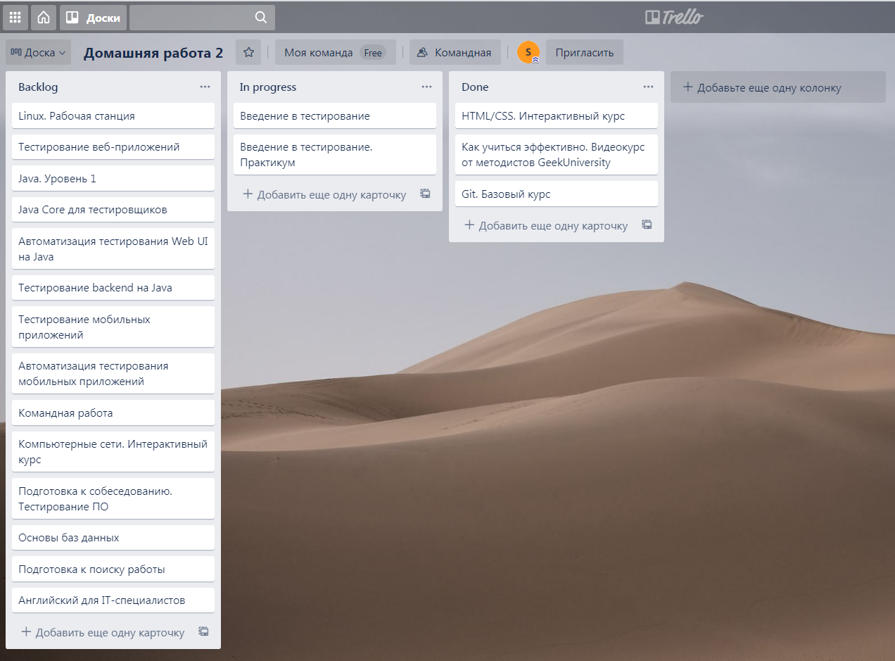
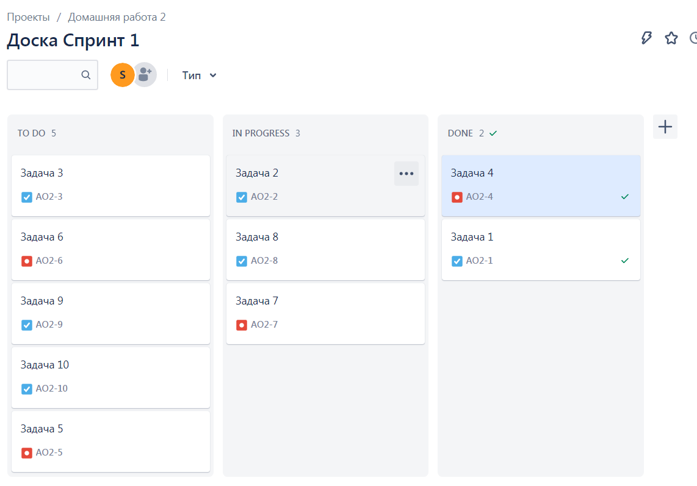
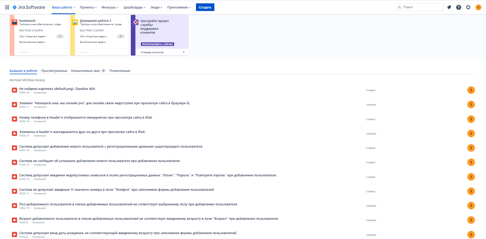
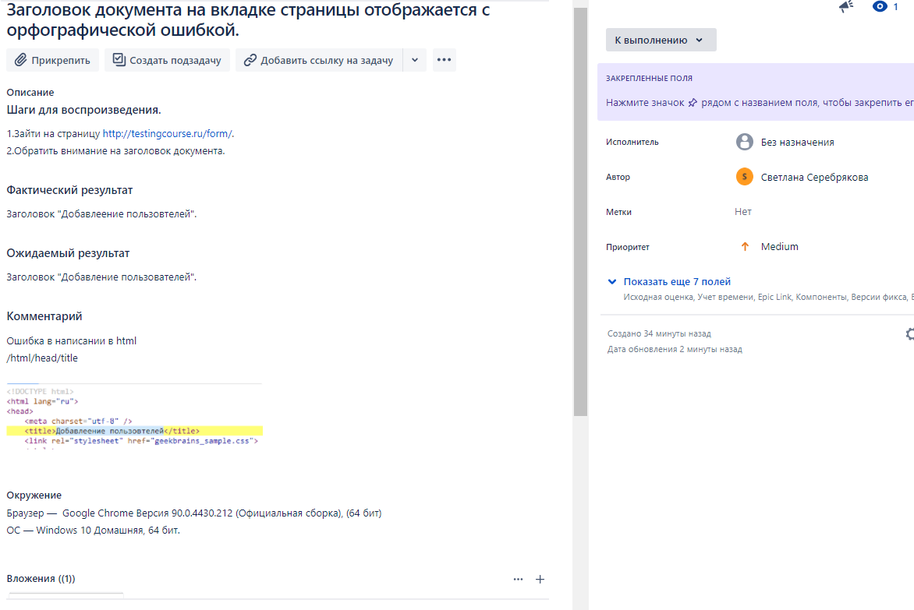
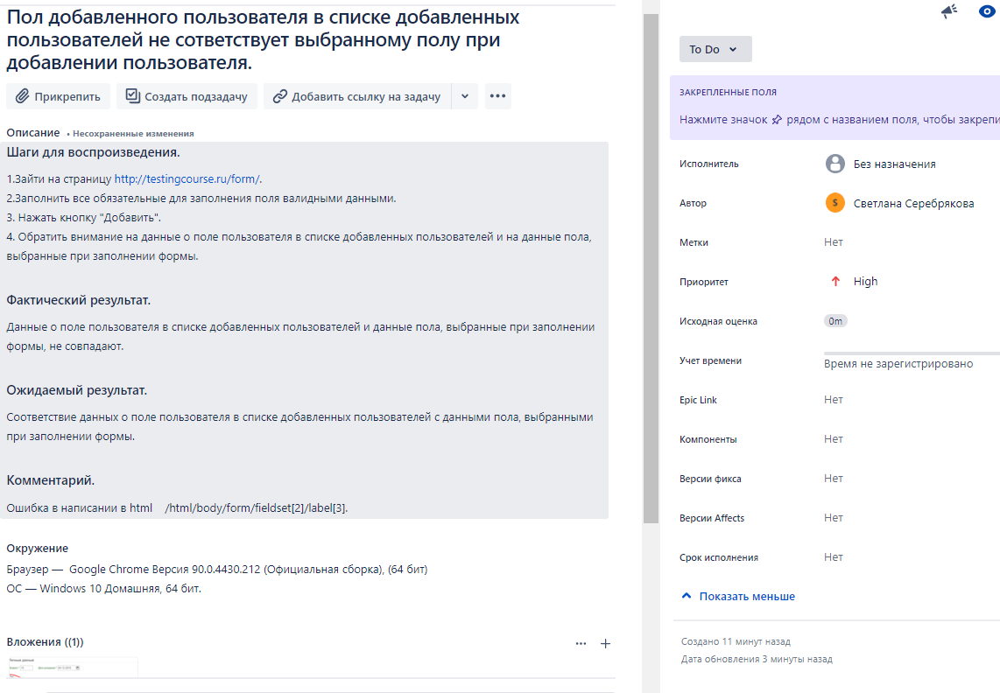
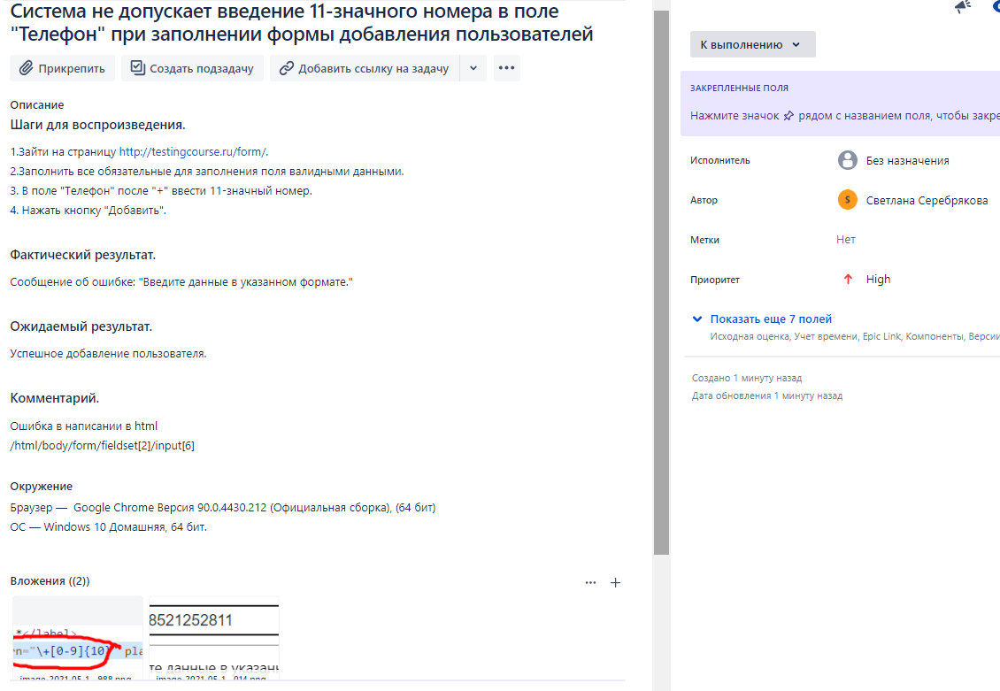
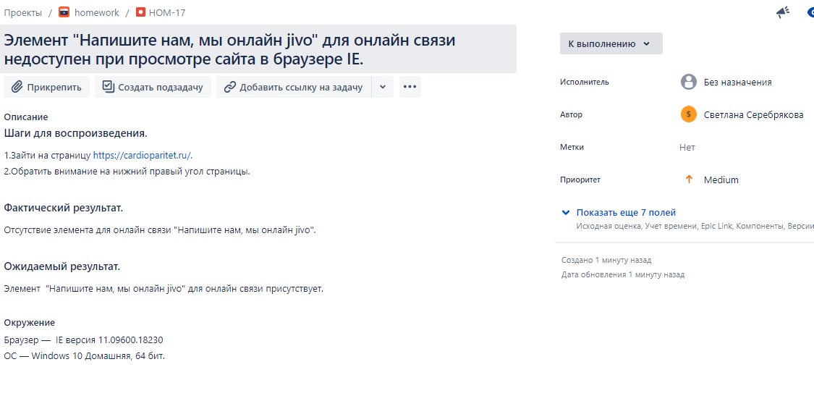
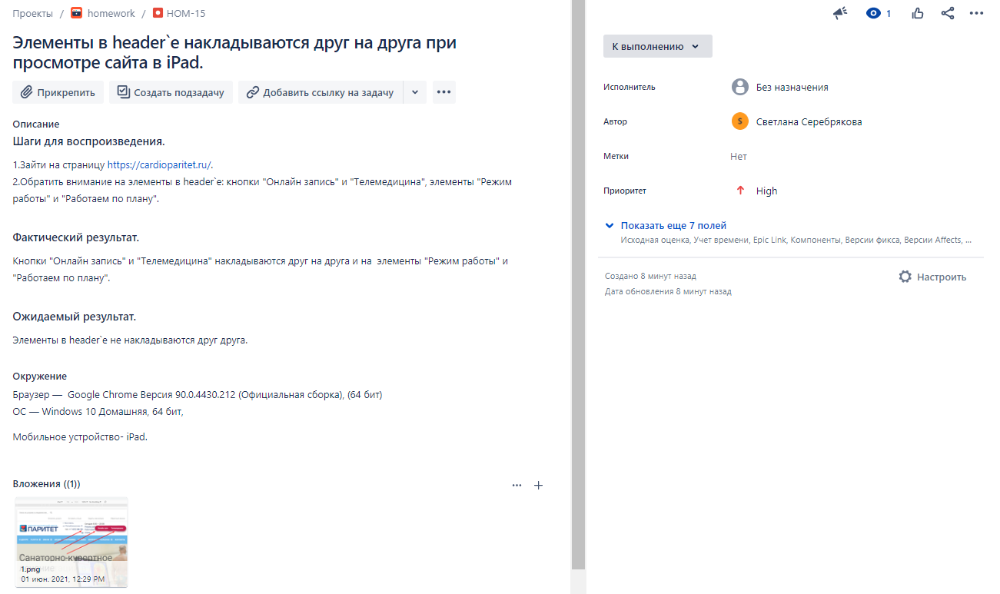
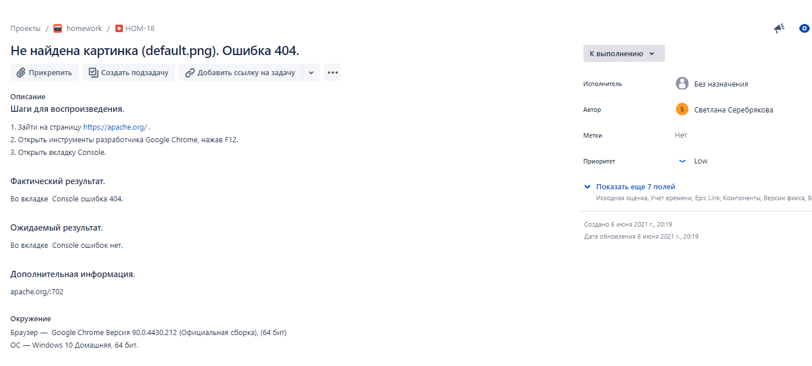
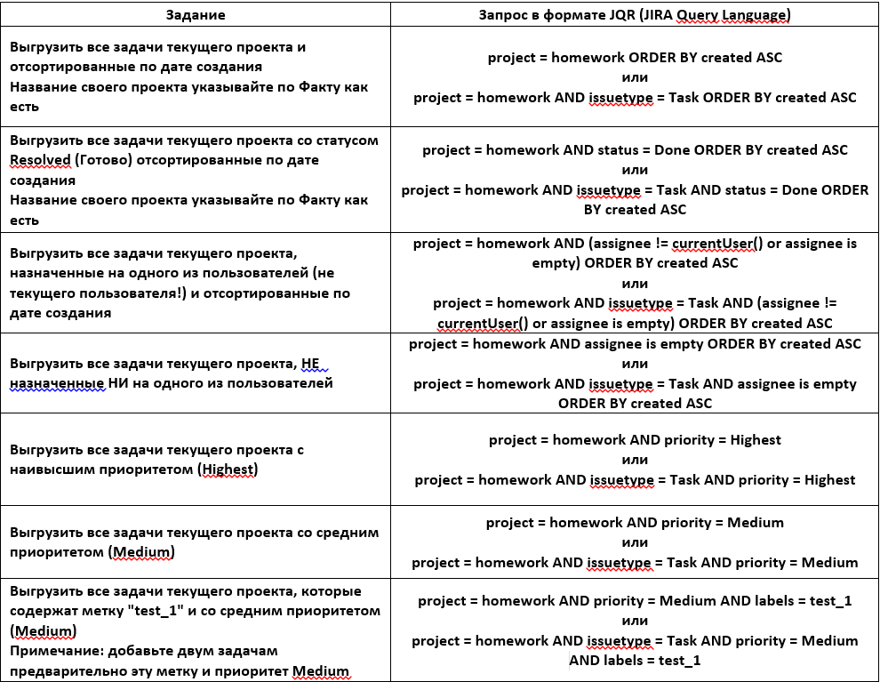

# Task Management System
## Создала Kanban-доску в Trello.

## Создла доску Scrum. Запустила Спринт1.

## Создала проекты в JIRA по шаблону баг трекинговой системы. Создала отчета о дефектах. 

## Составила запросы в Jira используя язык запросов JQL используя функцию "расширенный поиск".

